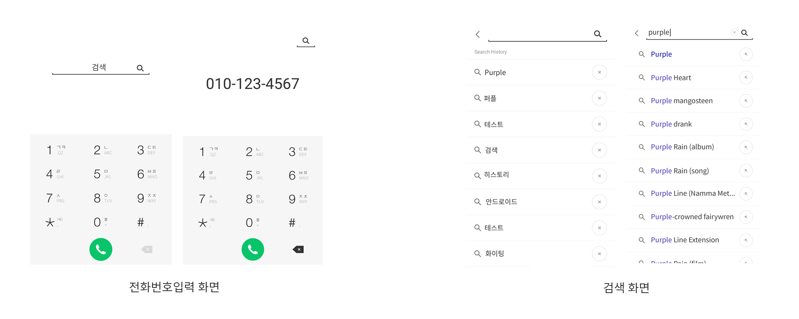
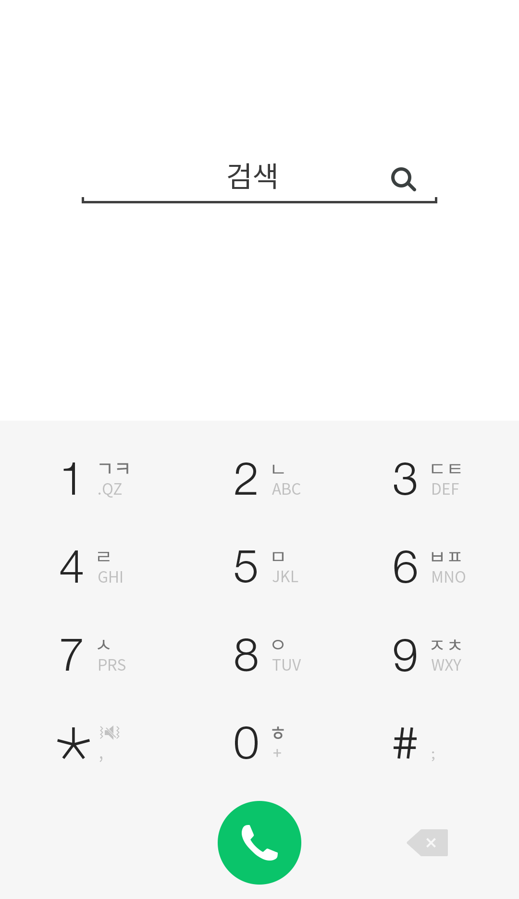
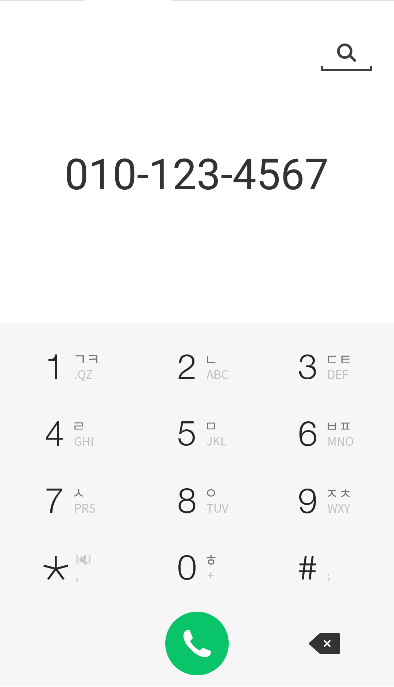
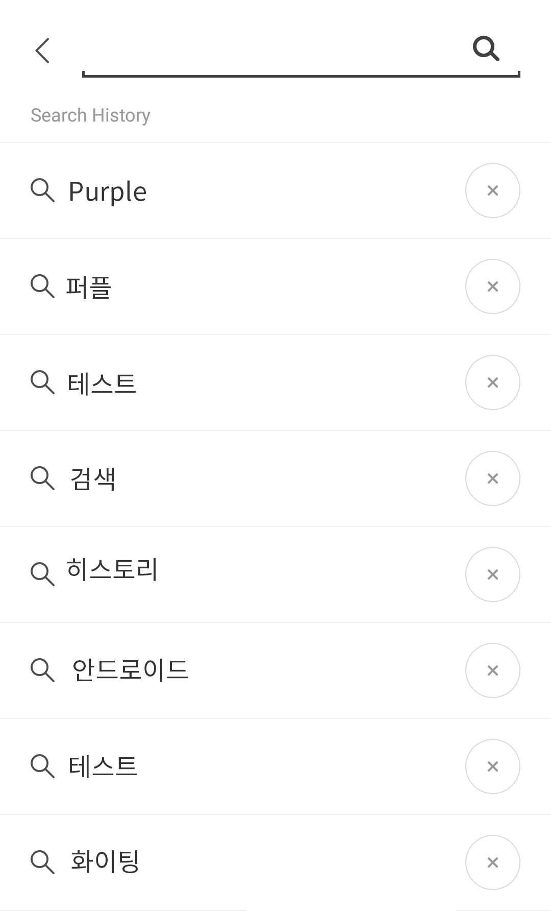
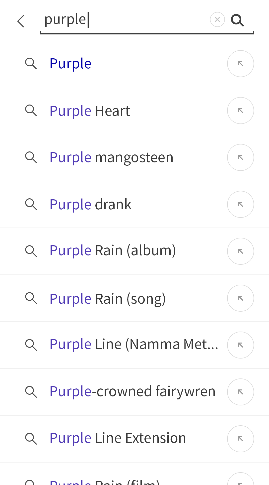

# Android 지원 테스트

Android 개발 분야에 지원하는 분을 위한 테스트 문제입니다.

하단의 요구사항을 읽고 실제로 동작하는 코드를 작성하고 APK 파일을 만들어주세요.

## 요구사항

- Android version: 7.0 이상 지원
- 개발언어: Kotlin
- 지원단말: Nexus 5 (1080x1920, xxhdpi)
- 화면: Portrait mode 만 지원

일반적인 전화 어플리케이션을 만듭니다. 전화번호를 입력하는 화면과 검색 화면 2가지가 있습니다. 자세한 사항은 하단 결과란을 참고해주세요.

## 결과



### 1. 전화번호 입력



- 검색창 선택 > 검색 화면으로 이동
- 하단 다이얼 영역은 상단 화면과 최대한 비슷하게 구현
- 숫자 또는 별표, 샵 선택 > 전화번호 입력
- 통화버튼 선택 > 입력한 전화번호로 전화요청
- 삭제버튼 선택 > 마지막에 입력한 글자 하나씩 삭제



- 검색화면이 가려지고 입력한 전화번호 출력
- 기존 검색창은 상단으로 이동
- 검색 아이콘 선택 > 검색 화면으로 이동
- 전화번호는 xxx-xxx-xxxx 또는 xxx-xxxx-xxxx로 표시 (-가 자동으로 입력)

### 2. 검색



- 최근에 입력한 검색어 20개를 보여줌
- 최근에 입력한 순으로 출력
- 검색 아이콘 또는 검색어 선택 > 상단 검색어 입력창에 자동으로 입력
- x 아이콘 선택 > 검색어 제거



- 검색창에 입력한 값을 Wikipedia [Opensearch API](https://www.mediawiki.org/wiki/API:Opensearch)의 두 번째 결과를 이용하여 결과를 출력
- 한 글자씩 입력할 때마다 실시간으로 검색결과 출력
- 상단 검색아이콘, 검색결과 왼쪽의 검색아이콘, 오른쪽 화살표 선택 > 동작 없음

### 샘플 검색 요청 및 결과

**request**

```
https://en.wikipedia.org/w/api.php?action=opensearch&search=purple
```

**response**

```
[
  "purple",
  [
    "Purple",
    "Purple Heart",
    "Purple mangosteen",
    "Purple drank",
    "Purple Rain (album)",
    "Purple Rain (song)",
    "Purple Line (Namma Metro)",
    "Purple-crowned fairywren",
    "Purple Line Extension",
    "Purple Rain (film)"
  ],
  [
    "Purple is a color intermediate between blue and red. It is similar to violet, but unlike violet, which is a spectral color with its own wavelength on the visible spectrum of light, purple is a composite color made by combining red and blue.",
    ...
  ],
  [
    "https://en.wikipedia.org/wiki/Purple",
    ...
  ]
]
```

## 참고

- 아이콘 이미지는 따로 제공하지 않습니다. https://www.flaticon.com/ 여기서 무료로 검색 후 사용하시면 됩니다.
- wikipedia api 상세 설명은 https://www.mediawiki.org/wiki/API:Main_page/ko 여기서 확인하시면 됩니다.

## 문의사항

`chungsub.kim@purpleworks.co.kr`로 메일 주세요.

감사합니다 :)
