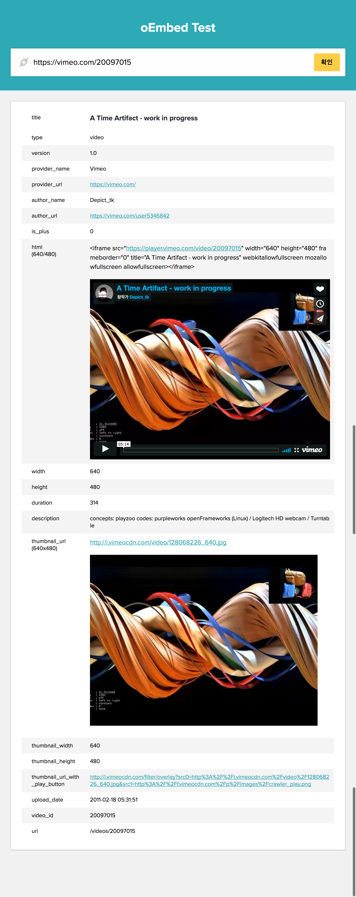

# Backend 지원 테스트 2

Backend 분야에 지원하는 분을 위한 테스트문제입니다.

하단의 요구사항을 읽고 실제로 동작하는 서버코드를 작성해주세요.

## 요구사항

youtube, instagram, twitter, vimeo등의 컨텐츠를 미리보여주는 사이트를 만드려고합니다.

URL을 입력받고 [oEmbed](http://oembed.com/) 데이터를 수집하여 보여주는 서비스입니다.

테스트 URL 리스트

- https://www.youtube.com/watch?v=dBD54EZIrZo
- https://www.instagram.com/p/BUawPlPF_Rx/
- https://twitter.com/hellopolicy/status/867177144815804416
- https://vimeo.com/20097015

## 참고 사이트

- [http://oembed.com/](http://oembed.com/)

## 결과 샘플

URL을 입력받는 폼을 만들고 확인 버튼을 누르면 해당 URL에 대한 oembed 정보를 출력하고 `html`값과 `thumbnail_url`은 미리보기로 보여줍니다.

## 문의사항

`chungsub.kim@purpleworks.co.kr`로 메일 주세요.

감사합니다 :)
